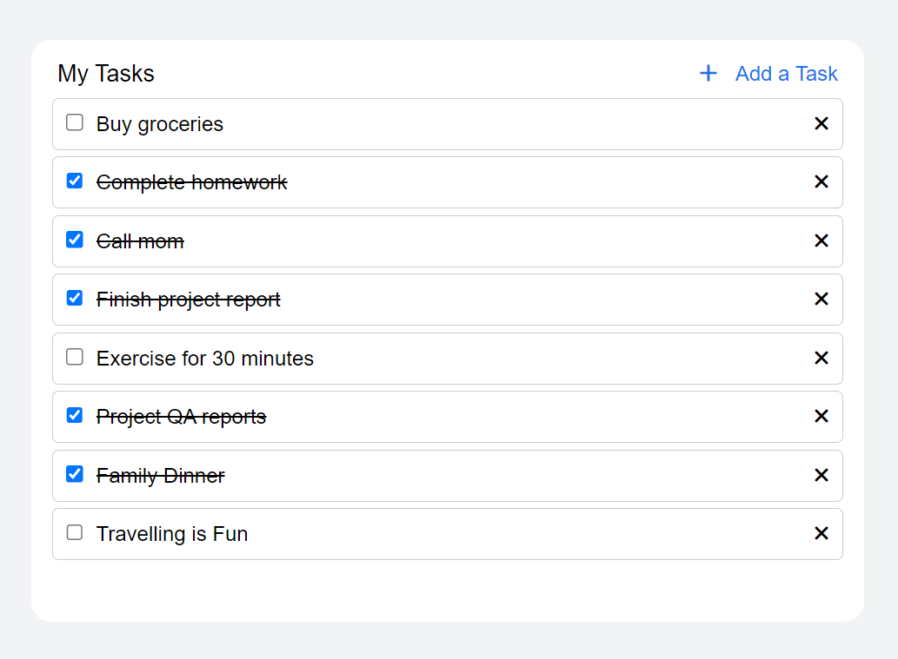

# Task To-Do App

## Description

This project is a Task To-Do application built using HTML, CSS, and JavaScript. It demonstrates various concepts such as DOM manipulation, arrays, loops, and CSS Flexbox. The application allows users to:

- Add new tasks
- Remove existing tasks
- Mark tasks as completed (with a line-through effect)
- Display tasks in a responsive design

## Features

- **Add Task**: Click the "Add Task" button to reveal an input field where you can enter a new task.
- **Remove Task**: Remove any task by clicking the "X" icon next to it.
- **Mark Task as Completed**: Check the checkbox to mark a task as completed. Completed tasks will be displayed with a line-through style.
- **Responsive Design**: The app adjusts to various screen sizes to ensure usability on different devices.

## Technologies Used

- **HTML**: Structure of the application.
- **CSS**: Styling and layout using Flexbox for responsive design.
- **JavaScript**: Dynamic functionality including task management (adding, removing, completing).

## Usage

1. **Add a Task**: Click the "Add Task" button to show the input field, enter your task, and press Enter or click the "Add" button.
2. **Complete a Task**: Check the checkbox next to a task to mark it as completed.
3. **Remove a Task**: Click the "X" icon next to a task to remove it from the list.

## Screenshot

## Contact

- **Name:** Muhammad Awais Arshad
- **GitHub:** [awaisarshad819](https://github.com/awaisarshad819)
- **Email:** [awaisarshad819@gmail.com](mailto:awaisarshad819@gmail.com)
- **LinkedIn:** [Muhammad Awais Arshad](https://www.linkedin.com/in/muhammadawais-arshad/)

## Thank You

Thank you for checking out my Task To-Do app project!
